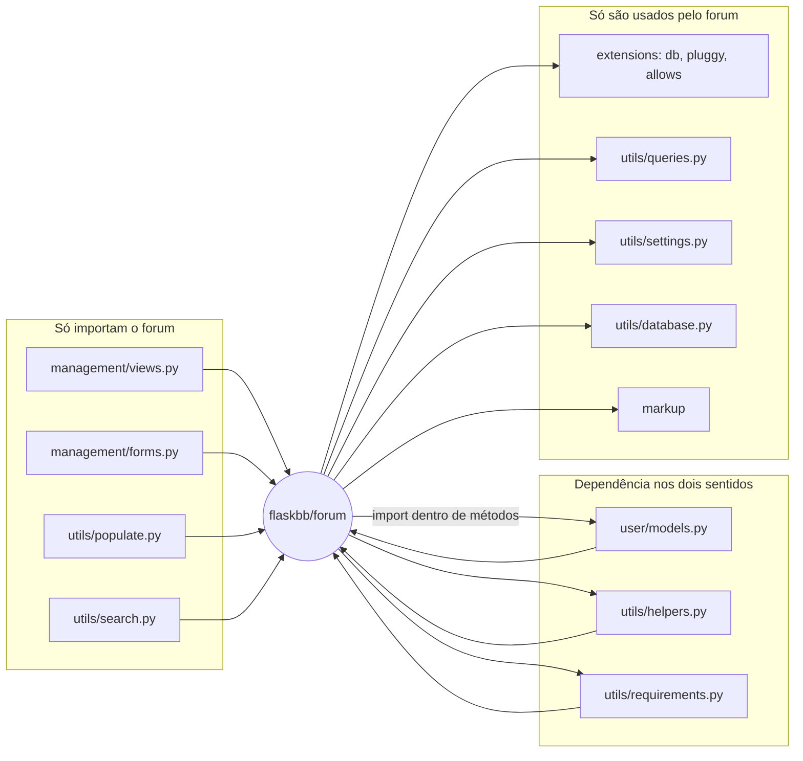

# Análise do módulo `flaskbb/forum/` como sistema legado — Parte 3, Tarefa 3.2

Linhas citadas valem para o fork no commit `2af86c5`. Os dados de
importação vêm de uma busca textual por `flaskbb.forum` em `flaskbb/*.py`
(sem a pasta `tests/`), e o histórico vem de `git log -- flaskbb/forum`.

## 1. Dependências

**Quem importa o módulo (importações diretas):**

| Arquivo | O que importa |
|---|---|
| `user/models.py:31` | `Forum`, `Post`, `Topic`, `topictracker` |
| `management/views.py:37-38` | `UserSearchForm`; `Category`, `Forum`, `Post`, `Report`, `Topic` |
| `management/forms.py:44` | `Category`, `Forum` |
| `utils/helpers.py:59` | `Category`, `Forum`, `ForumsRead`, `Topic`, `TopicsRead` (import indentado) |
| `utils/populate.py:24` | `Category`, `Forum`, `Post`, `Topic` |
| `utils/requirements.py:18-19` | `current_forum`, `current_post`, `current_topic`; `Forum`, `Post`, `Topic` |
| `utils/search.py:18` | `Forum`, `Post`, `Topic` |

`plugins/spec.py` só cita `flaskbb.forum.*` em docstrings, sem importar.

**O que o módulo importa:** `flaskbb.extensions` (`db`, `pluggy`, `allows`),
`flaskbb.user.models` (`User`, `Group`), `flaskbb.utils.helpers`,
`flaskbb.utils.queries`, `flaskbb.utils.settings` (`flaskbb_config`),
`flaskbb.utils.database`, `flaskbb.utils.requirements` e `flaskbb.markup`.
Externos: Flask, Flask-Login, Flask-Allows2, Flask-WTF, Flask-BabelPlus,
SQLAlchemy, WTForms e pluggy.

## 2. Acoplamento e coesão

**Alto acoplamento 1: ligação nos dois sentidos com `user/models.py`,
`utils/helpers.py` e `utils/requirements.py`.** O `user/models.py`
importa `forum.models` no topo (linha 31), então o `forum/models.py` não
pode fazer o inverso no topo. Por isso importa `User` e `Group` em 6 imports dentro de métodos (`models.py:989`, `1065`, `1354`, `1529`, `1575`, `1643`) e deixa
um `# todo: Find circular import and break it` em `models.py:1064`. Com
`utils/helpers.py` e `utils/requirements.py` a relação também vai e volta:
o `forum` os usa e eles importam `forum.models` (e, no caso de
`requirements`, `forum.locals`). Consequência: não dá para mexer num dos
lados sem conferir o outro, e a ordem dos imports vira parte do design.

**Alto acoplamento 2: regras de negócio presas à infraestrutura global.**
Em `models.py` há 61 usos de `db.session`, 18 de `time_utcnow`, 6 de
`pluggy.hook` e 4 de `flaskbb_config`. Regras como recontar posts ou
decidir o que é "não lido" fazem consulta, gravam e disparam eventos no
mesmo lugar, e só rodam com banco e configuração reais. Um exemplo é `Forum.update_read`, que tinha 0% de cobertura na baseline.

**Baixa coesão: a classe `Topic`** (`models.py:540-1073`, 23 métodos) reúne
responsabilidades diferentes: identidade e URL (`slug`, `url`), leitura e
rastreamento (`first_unread`, `tracker_needs_update`, `update_read`),
contadores (`recalculate`, `_fix_user_post_counts`, `_fix_post_counts`),
moderação (`hide`, `unhide`, `delete`, `move` e os `_remove_...` /
`_restore_...`) e consultas (`get_topic`, `get_posts`, `involved_users`).
Cada grupo muda por um motivo diferente, mas todos vivem na mesma classe.

## 3. Pontos de fragilidade

1. **Último post e contadores mantidos em vários lugares.** Depois da
   Parte 2, `Forum.set_last_post` centraliza a atribuição, mas
   `Topic._remove_topic_from_forum` (`models.py:959-986`) e
   `Topic._restore_topic_to_forum` (`models.py:1039-1049`) ainda atribuem os
   campos `last_post_*` um a um. Junte a isso `Post._deal_with_last_post`,
   `Post._update_counts`, `Topic._fix_post_counts` e `Forum.recalculate`, e a
   regra de "o que é o último post" e "quantos posts existem" está espalhada.
   Há também um `TODO` em `models.py:528` (`self.second_last_post = ...` num
   `Post`, sendo que `second_last_post` só existe como property de `Topic`).
   Mudar hide, unhide ou delete sem mexer em todos esses pontos deixa
   contadores e último post inconsistentes.
2. **Proxies `current_*` acoplados aos nomes dos parâmetros de rota.**
   `locals.py:22-59` resolve `current_post`, `current_topic`,
   `current_forum` e `current_category` a partir de `request.view_args`
   (`post_id`, `topic_id`, `forum_id`, `category_id`) e guarda o resultado em
   `g`. Esses proxies alimentam as permissões (`utils/requirements.py`) e o
   `force_login_if_needed` (`utils.py:25`). Renomear um parâmetro de rota, ou
   registrar uma rota com outro nome, muda o comportamento das permissões
   sem nenhum erro de importação. `locals.py` tem 38% de cobertura e
   `utils.py` 20%.
3. **Readtracker e `MarkRead` com pouca proteção de teste.**
   `Forum.update_read` (`models.py:1244-1308`) tinha 0% de cobertura, e
   `views.py` inteiro tem 7%, incluindo `MarkRead` (`views.py:934`) e
   `ManageForum`, que carrega um `# TODO(anr): Clean this up. @_@`
   (`views.py:411`). Uma mudança em quem é marcado como lido provavelmente não é detectada pela suíte. O ramo "todos os fóruns" da `MarkRead` cria um `ForumsRead` para
   todos os fóruns do banco e parece não ter rota registrada.

## 4. Leis de Lehman

O módulo mostra sobretudo a **Lei da Mudança Contínua** e a **da
Complexidade Crescente**. O histórico de `flaskbb/forum` tem 310 commits
anteriores aos nossos, de 11/09/2013 a 11/05/2026, e vários deles responderam a mudanças do ambiente, não a funcionalidades: Flask-WTF 0.9
(2013), Flask-Plugins (2014), Flask-Login com propriedades (2016),
Flask-BabelPlus e Flask-Whooshee (2016), SQLAlchemy 1.4 (2021), migração das
consultas para SQLAlchemy 2 com tipagem (jan/2026) e a troca para
Flask-Allows2 (fev/2026). A atividade é irregular: 285 commits em 2013-2018,
só 8 em 2019-2024 e 17 em 2026, quando as atualizações de dependências (SQLAlchemy 2, Flask-Allows2) motivaram um novo ciclo de mudanças. Já a complexidade é visível no
tamanho (`models.py` com 1700 linhas e `views.py` com 1344), na duplicação
que encontramos na Parte 2 (o "último post" era atribuído à mão em 4 lugares
e 2 ainda restam) e nos `TODO` ainda abertos (`models.py:177`, `528` e `1064`). Uma contagem
aproximada por palavra-chave nas mensagens mostra 79 commits com "fix",
"bug" ou similar, cerca de um quarto do total. Isso é compatível com a
degradação da qualidade quando o código é mudado sem uma refatoração que
acompanhe.

## 5. Seams identificáveis

1. **`Forum._count_unread_topics`** (`models.py:1209-1242`). Foi extraído na
   Parte 2 e agora concentra a query de "tópicos não lidos". Sobrescrever
   ou trocar esse método em teste permite exercitar `update_read` sem montar
   dados no banco. Em produção é o ponto natural para trocar a
   implementação da consulta (por exemplo, por um repositório, como
   veremos na Tarefa 3.3).
2. **`_get_item`** (`locals.py:48-59`). É o único lugar em que os proxies
   `current_*` tocam `g`, `request` e o banco. Fazer dele um ponto de
   injeção permite testar as regras de `utils/requirements.py` e o
   `force_login_if_needed` sem contexto de requisição HTTP e sem banco.

O módulo já tem um seam de extensão em produção: os hooks de `pluggy`
emitidos em `Post.save` e `Topic.save` (`flaskbb_event_post_save_*`,
`flaskbb_event_topic_save_*`).
