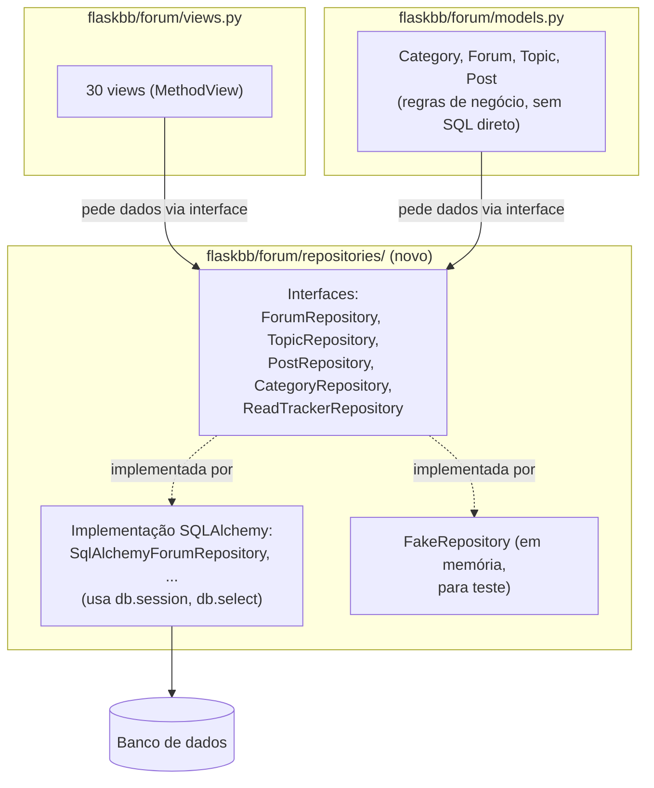

# Proposta de Evolução — Camada de Repositórios para `flaskbb/forum/`

Linhas citadas valem para o fork no commit `2af86c5`. Esta proposta é
descritiva: nada aqui foi implementado nesta parte.

## 1. Motivação

A Tarefa 3.2 mediu o quanto o módulo fala com o banco sem nenhuma camada
no meio: `models.py` tem 25 chamadas a `db.session.execute`, 18 a
`.scalar_one()`/`.scalar()` e 18 a `db.session.commit()`; `views.py` tem
**38 usos de `db.select`**, quase o mesmo tanto de `models.py` (35). Ou
seja, quem monta consultas SQLAlchemy não é só o modelo — as 30 views de
`views.py` também montam suas próprias, misturadas com HTTP, permissões e
templates. O Smell 1 do catálogo (`CODE_SMELLS.md`), a duplicação entre
`Category.get_all` (`models.py:1561-1627`) e `Category.get_forums`
(`models.py:1630-1700`), é um sintoma direto disso: como não existe um
lugar único responsável por "buscar fóruns visíveis para este usuário", a
mesma consulta de ~30 linhas foi copiada.

Essa mistura tem um custo que a Parte 2 já sentiu na prática: a
Refatoração 3 (`_count_unread_topics`, commit `b714774`) só pôde ser
validada por leitura do diff, porque `Forum.update_read` tinha 0% de
cobertura (`VALIDACAO.md`) — testar aquele método exigia banco de dados
de verdade, sessão e dados populados. A Tarefa 3.2 também apontou
`_get_item` (`locals.py:48-59`) como seam: hoje ele resolve `current_forum`
etc. direto no banco, e qualquer teste de permissão (`utils/requirements.py`)
precisa de um banco real por trás.

A proposta ataca a causa comum aos três achados: **isolar o SQLAlchemy
atrás de repositórios**, para que view e modelo peçam dados a uma
interface, não montem consultas.

## 2. Estado-alvo

Um repositório por agregado (`Forum`, `Topic`, `Post`, `Category`,
readtracker), cada um com uma interface abstrata e uma implementação
SQLAlchemy. Views e métodos de modelo passam a depender da interface, não
de `db.session` diretamente.

**Novos artefatos:**
- `flaskbb/forum/repositories/__init__.py` — expõe as interfaces.
- `flaskbb/forum/repositories/interfaces.py` — `ForumRepository`,
  `TopicRepository`, `PostRepository`, `CategoryRepository`,
  `ReadTrackerRepository` (classes abstratas com os métodos que views e
  modelos já chamam hoje, como `get_all_for_user`, `count_unread_topics`,
  `find_by_id`).
- `flaskbb/forum/repositories/sqlalchemy_repos.py` — implementação real,
  concentrando o `db.select`/`db.session` que hoje está espalhado.
- `flaskbb/forum/repositories/fakes.py` — implementação em memória, só
  para teste, sem banco.
- `flaskbb/extensions.py` — um ponto de registro (por exemplo
  `app.extensions["forum_repos"]`) para trocar a implementação real pela
  fake em teste, sem mudar o código de view/modelo.

## 3. Plano de migração incremental

1. **Criar as interfaces e a implementação SQLAlchemy, sem tocar no
   código existente.** `flaskbb/forum/repositories/` nasce do lado de
   `models.py`, com métodos que fazem exatamente as mesmas consultas que
   já existem (por exemplo, `SqlAlchemyForumRepository.count_unread_topics`
   chama o corpo hoje em `Forum._count_unread_topics`,
   `models.py:1209-1242`). Nada consome esse código ainda.
   *Como o sistema continua funcionando:* nenhum comportamento muda,
   porque nada foi religado.
   *Como se verifica:* a suíte roda sem alteração (`243 passed, 1
   skipped`); é só código novo e morto por enquanto.

2. **Migrar `Category.get_all` e `Category.get_forums` para o
   `CategoryRepository`** (o Smell 1 do catálogo). Os dois métodos passam
   a delegar ao repositório, mantendo a mesma assinatura pública.
   *Como o sistema continua funcionando:* quem chama `Category.get_all`
   (as views) não muda nenhuma linha, porque a assinatura é a mesma.
   *Como se verifica:* suíte completa verde; se possível, um teste novo
   que hoje falta para `get_forums`, usando o `FakeRepository`.

3. **Migrar `Forum._count_unread_topics` e `Forum.update_read`** para o
   `ForumRepository` (o seam já identificado na Tarefa 3.2). É o primeiro
   caso em que dá para testar sem banco: com o `FakeRepository`, um teste
   monta alguns tópicos em memória e chama `update_read` diretamente,
   fechando a lacuna de 0% de cobertura registrada em `VALIDACAO.md`.
   *Como o sistema continua funcionando:* a implementação real
   (`SqlAlchemyForumRepository`) roda a mesma query de antes; a assinatura
   de `update_read` não muda.
   *Como se verifica:* suíte completa verde, mais o teste novo de
   `update_read` citado acima.

4. **Migrar as 38 consultas de `views.py`, view por view, começando
   pelas mais simples** (por exemplo `ViewForum`, que hoje monta
   `db.select(Forum)` na própria view, `views.py:293`). Cada view troca a
   consulta direta por uma chamada ao repositório correspondente. É o
   passo mais longo do plano e pode ser feito em vários commits pequenos,
   um grupo de views por vez.
   *Como o sistema continua funcionando:* view por view, o comportamento
   observável (a página renderizada) não muda; views ainda não migradas
   continuam com `db.select` direto até sua vez.
   *Como se verifica:* suíte completa verde a cada commit; testes manuais
   das rotas migradas, já que `views.py` tem 7% de cobertura na baseline.

5. **Trocar a implementação por padrão em teste.** O `conftest.py` da
   suíte passa a registrar o `FakeRepository` para os testes que não
   precisam de SQL de verdade (checagem de regra de negócio), mantendo o
   `SqlAlchemyRepository` para os testes de integração que já usam banco.
   *Como o sistema continua funcionando:* em produção nada muda, porque a
   implementação real continua sendo a padrão fora dos testes.
   *Como se verifica:* a suíte deve continuar em `243 passed, 1 skipped`
   (ou mais, com os testes novos dos passos 2 e 3); tempo de execução da
   suíte deve cair, já que os testes movidos para `FakeRepository` deixam
   de tocar banco.

6. **Repetir os passos 2 a 4 para `Topic` e `Post`.** Só depois que
   `Forum` e `Category` estiverem estáveis, aplicar o mesmo padrão aos
   agregados restantes.
   *Como o sistema continua funcionando:* mesma lógica dos passos
   anteriores, incremento por agregado.
   *Como se verifica:* suíte completa verde a cada commit.

## 4. Riscos e mitigações

1. **Risco:** o `FakeRepository` reimplementa a query e diverge
   silenciosamente da versão SQLAlchemy (por exemplo, esquece o filtro de
   `read_cutoff` de `_count_unread_topics`). **Mitigação:** manter também
   testes de integração que rodam os dois lados (`Fake` e `SqlAlchemy`)
   com os mesmos casos e comparam o resultado, além de nunca remover os
   testes de integração existentes.
2. **Risco:** a migração incremental de `views.py` (passo 4) para no
   meio do caminho, deixando parte das views num padrão e parte no outro,
   confundindo quem lê o código depois. **Mitigação:** migrar por grupos
   fechados de views relacionadas (por exemplo, todas as de moderação de
   tópico) e registrar o progresso em um arquivo `MIGRACAO_REPOSITORIOS.md`
   dentro do próprio `forum/`, listando o que já foi migrado.
3. **Risco:** o ciclo de import hoje contornado com imports locais
   (`from flaskbb.user.models import Group` dentro de métodos, por
   exemplo `models.py:1575`) pode piorar se os repositórios criarem novas
   dependências cruzadas entre `forum` e `user`. **Mitigação:** repositórios
   de `forum` só recebem tipos de `user` como parâmetro (não importam
   `user.models` no topo do arquivo), do mesmo jeito que `models.py` já
   faz hoje.

## 5. Fora do escopo

- Trocar o SQLAlchemy por outro ORM ou por SQL puro — a proposta isola o
  ORM, não o substitui.
- Extrair o `forum` como serviço HTTP separado (essa seria a proposta 1
  do enunciado, não esta).
- Migrar `flaskbb/management/` e `flaskbb/user/`, mesmo eles também
  importando `forum.models` diretamente (Tarefa 3.2, seção 1) — ficam
  fora por não estarem no hotspot escolhido.
- Mudar o schema do banco ou as migrações existentes.
- Reescrever os templates ou a camada de formulários (`forms.py`).
